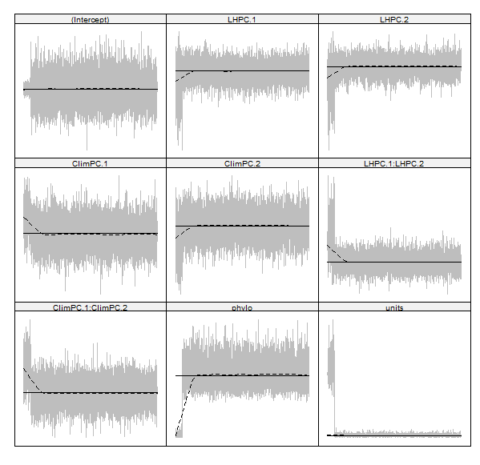

# Priori information & model settings

-   prior_phylo\<-list(G=list(G1=list(V=1,nu=0.02)), R=list(V=1,nu=0.02))
-   nitt=100000; \# Aumentei substancialmente!
-   burnin=1000;
-   thin=10 \# Aumentei de 3 para 10 para aumentar o sample size
-   glmmScale\<-"FALSE"

# Cria os modelos MCMCglmm (APENAS CUMULATIVE SIG CONSIDERADO!!!!)

```{r eval=FALSE, echo=T}

data_model%>%glimpse()

library(MCMCglmm)
library(MuMIn)


Clim123<-MCMCglmm(Cumulative_SigElas~LHPC.1 * LHPC.2 + ClimPC.1 * ClimPC.2 * ClimPC.3,
                    random=~phylo,family="gaussian",
                    ginverse=list(phylo=inverseA(subtree_Plants,nodes="TIPS",scale=TRUE)$Ainv),
                    prior=prior_phylo,data=subset(data_model,Kingdom=="Plantae"),
                    nitt=nitt,burnin=burnin,thin=thin,singular.ok=TRUE, scale = glmmScale)

Clim12<-MCMCglmm(Cumulative_SigElas~LHPC.1 * LHPC.2 + ClimPC.1 * ClimPC.2 ,
                    random=~phylo,family="gaussian",
                    ginverse=list(phylo=inverseA(subtree_Plants,nodes="TIPS",scale=TRUE)$Ainv),
                    prior=prior_phylo,data=subset(data_model,Kingdom=="Plantae"),
                    nitt=nitt,burnin=burnin,thin=thin,singular.ok=TRUE, scale = glmmScale)

Clim13<-MCMCglmm(Cumulative_SigElas~LHPC.1 * LHPC.2 + ClimPC.1 * ClimPC.3 ,
                      random=~phylo,family="gaussian",
                      ginverse=list(phylo=inverseA(subtree_Plants,nodes="TIPS",scale=TRUE)$Ainv),
                      prior=prior_phylo,data=subset(data_model,Kingdom=="Plantae"),
                      nitt=nitt,burnin=burnin,thin=thin,singular.ok=TRUE, scale = glmmScale)


Clim23<-MCMCglmm(Cumulative_SigElas~LHPC.1 * LHPC.2 + ClimPC.2 * ClimPC.3 ,
                      random=~phylo,family="gaussian",
                      ginverse=list(phylo=inverseA(subtree_Plants,nodes="TIPS",scale=TRUE)$Ainv),
                      prior=prior_phylo,data=subset(data_model,Kingdom=="Plantae"),
                      nitt=nitt,burnin=burnin,thin=thin,singular.ok=TRUE, scale = glmmScale)


Clim2<-MCMCglmm(Cumulative_SigElas~LHPC.1 * LHPC.2 + ClimPC.2,
                 random=~phylo,family="gaussian",
                 ginverse=list(phylo=inverseA(subtree_Plants,nodes="TIPS",scale=TRUE)$Ainv),
                 prior=prior_phylo,data=subset(data_model,Kingdom=="Plantae"),
                 nitt=nitt,burnin=burnin,thin=thin,singular.ok=TRUE, scale = glmmScale)

Clim1<-MCMCglmm(Cumulative_SigElas~LHPC.1 * LHPC.2 + ClimPC.1,
                random=~phylo,family="gaussian",
                ginverse=list(phylo=inverseA(subtree_Plants,nodes="TIPS",scale=TRUE)$Ainv),
                prior=prior_phylo,data=subset(data_model,Kingdom=="Plantae"),
                nitt=nitt,burnin=burnin,thin=thin,singular.ok=TRUE, scale = glmmScale)

Clim3<-MCMCglmm(Cumulative_SigElas~LHPC.1 * LHPC.2 + ClimPC.3,
                random=~phylo,family="gaussian",
                ginverse=list(phylo=inverseA(subtree_Plants,nodes="TIPS",scale=TRUE)$Ainv),
                prior=prior_phylo,data=subset(data_model,Kingdom=="Plantae"),
                nitt=nitt,burnin=burnin,thin=thin,singular.ok=TRUE, scale = glmmScale)


Clim123_plus<-MCMCglmm(Cumulative_SigElas~LHPC.1 * LHPC.2 + ClimPC.1 + ClimPC.2 + ClimPC.3,
                  random=~phylo,family="gaussian",
                  ginverse=list(phylo=inverseA(subtree_Plants,nodes="TIPS",scale=TRUE)$Ainv),
                  prior=prior_phylo,data=subset(data_model,Kingdom=="Plantae"),
                  nitt=nitt,burnin=burnin,thin=thin,singular.ok=TRUE, scale = glmmScale)


Clim12_plus<-MCMCglmm(Cumulative_SigElas~LHPC.1 * LHPC.2 + ClimPC.1 + ClimPC.2,
                       random=~phylo,family="gaussian",
                       ginverse=list(phylo=inverseA(subtree_Plants,nodes="TIPS",scale=TRUE)$Ainv),
                       prior=prior_phylo,data=subset(data_model,Kingdom=="Plantae"),
                       nitt=nitt,burnin=burnin,thin=thin,singular.ok=TRUE, scale = glmmScale)

Clim12_plus_only<-MCMCglmm(Cumulative_SigElas~LHPC.1 + LHPC.2 + ClimPC.1 + ClimPC.2,
                      random=~phylo,family="gaussian",
                      ginverse=list(phylo=inverseA(subtree_Plants,nodes="TIPS",scale=TRUE)$Ainv),
                      prior=prior_phylo,data=subset(data_model,Kingdom=="Plantae"),
                      nitt=nitt,burnin=burnin,thin=thin,singular.ok=TRUE, scale = glmmScale)

```

# Comparação dos modelos

-   Precisa do pacote MuMIn para funcionar

```{r eval=FALSE, echo=T}
library(MuMIn) # Necessário para comparar multiplos modelos com BIC, AIC e DIC
library(DT) #Tabela apresentável

```

```{r eval=FALSE, echo=T}
forms<-lapply(
  lapply(
    list(Clim1,Clim2,Clim3,
         Clim123,
         Clim12,Clim13,Clim23,
         Clim123_plus,Clim12_plus,
         Clim12_plus_only),formula),
          function(f) paste(deparse(formula(f)), collapse = ""))%>%do.call(rbind,.)

mod_out<-cbind(formulas=forms,
  BIC(Clim1,Clim2,Clim3,Clim123,Clim12,Clim13,Clim23,Clim123_plus,Clim12_plus,Clim12_plus_only),
  AIC=AIC(Clim1,Clim2,Clim3,Clim123,Clim12,Clim13,Clim23,Clim123_plus,Clim12_plus,Clim12_plus_only)[,2],
  DIC=DIC(Clim1,Clim2,Clim3,Clim123,Clim12,Clim13,Clim2,Clim123_plus,Clim12_plus,Clim12_plus_only)[,2])%>%
  arrange(DIC)
```

```{r eval=F, echo=T}
mod_out%>%
   dplyr::mutate(across(where(is.numeric), round, 1))%>%
  datatable()
```

Modelos Clim12 é o mais adequado! Depois dele o modelo considerando apenas variaveis aditivas!

| Modelo | formulas | df | BIC | AIC | DIC |
|:------:|:-------------------------------:|:------:|:------:|:------:|:------:|
| **Clim12** | **Cumulative_SigElas \~ LHPC.1 \* LHPC.2 + ClimPC.1 \* ClimPC.2** | **9** | **-384.98** | **-410.14** | **-404.16** |
| Clim12_plus_only | Cumulative_SigElas \~ LHPC.1 + LHPC.2 + ClimPC.1 + ClimPC.2 | 7 | -416.29 | -435.86 | -391.15 |
| Clim123_plus | Cumulative_SigElas \~ LHPC.1 \* LHPC.2 + ClimPC.1 + ClimPC.2 + ClimPC.3 | 9 | -403.14 | -428.30 | -389.12 |
| Clim12_plus | Cumulative_SigElas \~ LHPC.1 \* LHPC.2 + ClimPC.1 + ClimPC.2 | 8 | -411.97 | -434.34 | -379.77 |
| Clim2 | Cumulative_SigElas \~ LHPC.1 \* LHPC.2 + ClimPC.2 | 7 | -421.21 | -440.78 | -376.24 |
| Clim23 | Cumulative_SigElas \~ LHPC.1 \* LHPC.2 + ClimPC.2 \* ClimPC.3 | 9 | -416.12 | -441.29 | -376.24 |
| Clim3 | Cumulative_SigElas \~ LHPC.1 \* LHPC.2 + ClimPC.3 | 7 | -415.60 | -435.17 | -370.75 |
| Clim13 | Cumulative_SigElas \~ LHPC.1 \* LHPC.2 + ClimPC.1 \* ClimPC.3 | 9 | -400.42 | -425.58 | -367.66 |
| Clim123 | Cumulative_SigElas \~ LHPC.1 \* LHPC.2 + ClimPC.1 \* ClimPC.2 \* ClimPC.3 | 13 | -385.14 | -421.48 | -366.14 |
| Clim1 | Cumulative_SigElas \~ LHPC.1 \* LHPC.2 + ClimPC.1 | 7 | -384.56 | -404.13 | -340.15 |

# Principais models e seus outputs:

### Clim 123 - Modelo sugerido pelo revisor

-   **Posição: 9th pior modelo!**
-   Fórmula *Cumulative_SigElas \~ LHPC.1 \* LHPC.2 + ClimPC.1 \* ClimPC.2 \* ClimPC.3*
-   Apenas LHPC.1 é significativo e a interação LHPC1 x LHPC2 é marginalmente significativo

|                   | post.mean  |  l-95% CI  |  u-95% CI  |   eff.samp    |    pMCMC     |
|:----------:|:----------:|:----------:|:----------:|:----------:|:----------:|
|    (Intercept)    |   0.053    |   -0.294   |   0.401    |   8357.528    |    0.754     |
|    **LHPC.1**     | **-0.012** | **-0.023** | **-0.002** | **10369.741** | **0.022** \* |
|      LHPC.2       |   -0.006   |   -0.022   |   0.011    |     9900      |    0.498     |
|     ClimPC.1      |   0.017    |   -0.028   |   0.061    |     9900      |    0.464     |
|     ClimPC.2      |   -0.006   |   -0.075   |    0.06    |   11514.187   |    0.849     |
|     ClimPC.3      |   0.039    |   -0.029   |   0.105    |     9900      |    0.262     |
|  *LHPC.1:LHPC.2*  |  *0.007*   |  *-0.002*  |  *0.016*   |  *9531.462*   |   *0.094*.   |
| ClimPC.1:ClimPC.2 |   0.017    |   -0.041   |   0.073    |   10245.923   |    0.561     |
| ClimPC.1:ClimPC.3 |   -0.013   |   -0.07    |   0.047    |   10169.172   |    0.652     |
| ClimPC.2:ClimPC.3 |   0.046    |   -0.03    |   0.122    |     9900      |    0.235     |

### Clim 12: Modelo inicial

-   Melhor modelo (DIC = **-404)**
-   Fórmula *Cumulative_SigElas \~ LHPC.1 \* LHPC.2 + ClimPC.1 \* ClimPC.2*
-   Mantem a mesma discussão do artigo inicialmente

|                   | post.mean  |  l-95% CI  | u-95% CI  |  eff.samp   |   pMCMC   |
|:-----------:|:----------:|:----------:|:----------:|:----------:|:----------:|
|    (Intercept)    |   0.065    |   -0.279   |   0.409   |    9900     |   0.676   |
|    **LHPC.1**     | **-0.011** | **-0.023** |   **0**   | **281.596** | **0.039** |
|      LHPC.2       |   -0.006   |   -0.026   |   0.013   |   115.033   |   0.523   |
|     ClimPC.1      |   0.018    |   -0.017   |   0.054   |   563.049   |   0.318   |
|   **ClimPC.2**    | **0.036**  | **0.008**  | **0.063** | **785.354** | **0.022** |
|   LHPC.1:LHPC.2   |   0.007    |   -0.005   |   0.018   |   45.735    |   0.174   |
| ClimPC.1:ClimPC.2 |   0.014    |   -0.007   |   0.038   |   93.823    |   0.163   |

### Traceplot Model Clim 12 is OK!

Below The traceplot for MCMCglmm model Clim 12 (*Cumulative_SigElas \~ LHPC.1 \* LHPC.2 + ClimPC.1 \* ClimPC.2).*

-   Take home message: Model converge!

```{r eval=F, echo=T}
allChains <- mcmcr::as.mcmc(cbind(Clim12$Sol,Clim12$VCV))
plotMCMC::plotTrace(allChains)
```


